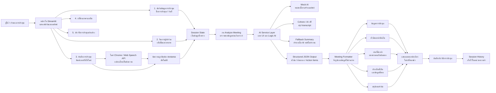
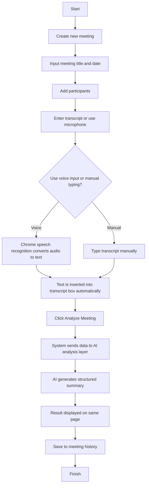
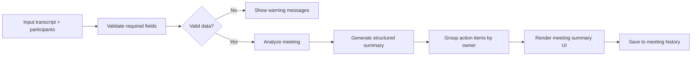

# AI Meeting Assistant

## 1. Overview
AI Meeting Assistant is a web application designed to help users convert meeting discussions into structured summaries automatically. The system supports transcript input, participant management, meeting history, and AI-based analysis to generate useful outputs such as:

- Meeting information
- Key topics and decisions
- Action items grouped by owner
- Open issues and missing information
- Summary by topic

The application is implemented as a Streamlit web app and focuses on a simple, same-page workflow so users can enter data and view results without navigating to a separate result page.

---

## 2. System Architecture

> การอ่าน flow นี้คือ: ผู้ใช้กรอกข้อมูลการประชุม → ข้อมูลถูกเก็บไว้ใน Session State → กดวิเคราะห์ → ระบบส่งข้อมูลเข้าสู่ AI Service → AI สร้างสรุปแบบโครงสร้าง → Formatter จัดข้อมูลให้อ่านง่าย → แสดงผลบนหน้าเดียว → บันทึกประวัติไว้เพื่อดูย้อนหลัง

---

## 3. User Flow

---

## 4. Functional Workflow

### 4.1 Frontend Layer
The web interface is built with Streamlit and includes:

- Meeting name and date form
- Transcript input area
- Participant management
- Meeting analysis button
- Theme toggle for light/dark mode
- Language switch for Thai/English
- Sidebar with meeting history

### 4.2 Input Layer
Users can provide meeting data by:

1. Typing transcript text manually, or
2. Using the Chrome microphone feature to convert speech to text automatically

The microphone input is handled by the browser Web Speech API, and the recognized text is inserted directly into the transcript field without the need for a backend API connection.

### 4.3 Processing Layer
Once the transcript and participant list are ready, the system sends the data to an AI analysis service. The analysis layer can work with:

- Mock AI for testing and demonstration
- Free AI / external provider fallback
- Structured-output generation for JSON-based summary extraction

This keeps the UI independent from the provider logic and allows the application to switch AI backends easily.

### 4.4 Formatter Layer
The analysis result is converted into a consistent output structure. The formatter organizes the data into the following sections:

- Meeting Information
- Topics and Decisions
- Action Items grouped by owner
- Open Issues and Missing Information
- Summary by Topic

### 4.5 Output Layer
The final results are displayed in the same page without redirecting to another page. This is designed for quick review and easier user interaction.

### 4.6 Persistence Layer
The system stores meeting summaries in session-based history for quick retrieval and review. This allows users to reload previous meeting reports without creating a separate database system in the MVP stage.

---

## 5. Business Logic Flow

---

## 6. Major Components

### Streamlit UI
Handles the main interface and workflow:

- meeting creation
- transcript entry
- analysis trigger
- layout and theme control
- result display

### Session State
Stores the current values in memory, including:

- meeting name
- date
- transcript
- participants
- analysis output
- theme settings
- language settings
- history list

### AI Analysis Service
Responsible for converting raw transcript into structured meeting results. It acts as a boundary between the UI and the AI logic.

### Formatter Service
Responsible for shaping analysis results into a readable format and grouping items logically for output display.

---

## 7. Example of Result Output
The system produces output such as:

- Meeting Information
  - Meeting title
  - Date
  - Participants

- Topics & Decisions
  - Key topics discussed
  - Decisions made

- Action Items
  - Task name
  - Owner name
  - Follow-up responsibility

- Open Issues & Missing Information
  - Risks or unresolved items
  - Missing details or missing information needed

- Summary by Topic
  - A condensed overview of main discussion themes

---

## 8. Summary
The AI Meeting Assistant is a lightweight meeting summarization system built for fast use in a local MVP environment. It allows users to create meetings, input transcripts, use browser-based speech recognition, analyze discussions with AI or mock logic, and view structured summary results directly on the same page. The design keeps the system simple, user-friendly, and suitable for further extension with real AI APIs, database storage, and more advanced collaboration features in the future.

---

## 9. Project Status
Current implementation includes:

- same-page meeting analysis flow
- structured result display
- AI / mock analysis boundary
- owner-based action grouping
- language and theme switching
- meeting history sidebar
- Chrome microphone transcription support

This version is suitable for demonstration and functional prototype presentation.
